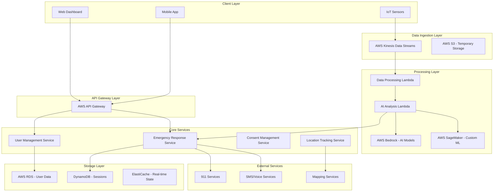

# AllSenses AI Guardian - Design Document

## Overview

AllSenses is designed as a cloud-native, event-driven AI safety platform that processes multimodal sensor data in real-time to detect and respond to emergency situations. The system follows a microservices architecture with clear separation between data ingestion, AI processing, emergency response, and user management components.

The platform leverages AWS managed services for scalability and reliability while maintaining a privacy-first approach through encryption, consent management, and temporary data storage patterns.

## Architecture

### High-Level Architecture



### Technology Stack Integration

The design leverages a modern cloud-native technology stack optimized for real-time AI processing and emergency response:

- **Core Services**: Spring Boot 3.2.0 microservices with Spring Cloud for service discovery and configuration
- **Data Processing**: AWS Lambda functions and Kinesis for real-time stream processing
- **AI/ML**: AWS Bedrock for foundation models, SageMaker for custom threat detection models
- **Storage**: PostgreSQL on RDS (structured data), DynamoDB (sessions), ElastiCache Redis (real-time state)
- **Frontend**: Progressive Web App (PWA) using HTML5/CSS3/Vanilla JavaScript with offline capabilities
- **Infrastructure**: AWS CloudFormation for Infrastructure as Code, Docker for containerization

## Components and Interfaces

### 1. Data Ingestion Service

**Purpose**: Collect and preprocess multimodal sensor data from various sources.

**Key Interfaces**:
```java
@RestController
public class DataIngestionController {
    @PostMapping("/api/v1/sensors/audio")
    ResponseEntity<Void> ingestAudioData(@RequestBody AudioDataRequest request);
    
    @PostMapping("/api/v1/sensors/motion")
    ResponseEntity<Void> ingestMotionData(@RequestBody MotionDataRequest request);
    
    @PostMapping("/api/v1/sensors/environmental")
    ResponseEntity<Void> ingestEnvironmentalData(@RequestBody EnvironmentalDataRequest request);
}
```

**Responsibilities**:
- Validate incoming sensor data
- Apply initial filtering and normalization
- Route data to appropriate processing streams
- Maintain data lineage for privacy compliance

### 2. AI Analysis Engine

**Purpose**: Process multimodal data streams to detect potential threats and distress signals.

**Key Components**:
- **Threat Detection Pipeline**: Analyzes patterns across audio, motion, and environmental data
- **Confidence Scoring**: Assigns probability scores to potential threats
- **Context Correlation**: Combines multiple data sources for comprehensive threat assessment
- **Model Management**: Handles deployment and versioning of AI models

**Integration Points**:
- AWS Bedrock for foundation model inference
- AWS SageMaker for custom threat detection models
- Real-time streaming through Kinesis Data Analytics

### 3. Emergency Response Service

**Purpose**: Orchestrate emergency response workflows when threats are confirmed.

**Key Interfaces**:
```java
@Service
public class EmergencyResponseService {
    public EmergencyResponse processEmergencyAlert(ThreatAssessment threat);
    public void contactEmergencyServices(EmergencyContext context);
    public void notifyTrustedContacts(List<Contact> contacts, EmergencyContext context);
    public void trackEmergencyResolution(String emergencyId);
}
```

**Responsibilities**:
- Validate threat confidence levels against thresholds
- Coordinate simultaneous contact with 911 and trusted contacts
- Manage emergency context data transmission
- Track emergency resolution and cleanup

### 4. User Management Service

**Purpose**: Handle user registration, consent management, and privacy controls.

**Key Features**:
- Consent lifecycle management
- Trusted contact configuration
- Privacy preference enforcement
- User authentication and authorization

### 5. Location Tracking Service

**Purpose**: Provide precise location data for emergency response.

**Key Capabilities**:
- GPS coordinate processing with accuracy validation
- Location history for context (with privacy controls)
- Integration with mapping services for address resolution
- Geofencing for location-based threat assessment

### 6. Enhanced Emergency Detection System

**Purpose**: Provide dual detection capabilities with real-time visual feedback for comprehensive emergency monitoring.

**Key Components**:
- **Visual Listening Indicator**: Real-time status display showing active monitoring state
- **Emergency Words Detection**: Continuous speech recognition for emergency keywords
- **Abrupt Noise Detection**: Real-time audio analysis for sudden volume spikes
- **Immediate SMS Notifications**: Direct AWS SNS integration for emergency contact alerts

**Key Interfaces**:
```javascript
class EnhancedEmergencyMonitor {
    startContinuousMonitoring();
    updateListeningIndicator(active, status);
    checkEmergencyWords(transcript);
    detectAbruptNoise(volumeLevel);
    sendEmergencyNotification(type, data);
    displayEmergencyAlert(alertData);
}
```

**Technical Implementation**:
- **Web Speech API**: Continuous speech recognition for emergency word detection
- **Web Audio API**: Real-time audio analysis for volume threshold monitoring
- **AWS Lambda Integration**: Direct function URL calls for immediate SMS sending
- **Visual Feedback System**: Professional emergency UI with status indicators and alerts

## Data Models

### Core Entities

```java
@Entity
public class User {
    @Id
    private String userId;
    private String email;
    private ConsentStatus consentStatus;
    private List<TrustedContact> trustedContacts;
    private PrivacyPreferences privacySettings;
    private LocalDateTime consentTimestamp;
}

@Entity
public class ThreatAssessment {
    @Id
    private String assessmentId;
    private String userId;
    private ThreatLevel threatLevel;
    private Double confidenceScore;
    private List<SensorReading> sensorData;
    private LocationData location;
    private LocalDateTime timestamp;
    private AssessmentStatus status;
}

@Entity
public class EmergencyEvent {
    @Id
    private String eventId;
    private String userId;
    private ThreatAssessment initialAssessment;
    private List<ResponseAction> responseActions;
    private EventStatus status;
    private LocalDateTime createdAt;
    private LocalDateTime resolvedAt;
}
```

### Privacy-Compliant Data Handling

- **Encryption**: All PII encrypted at rest using AES-256
- **Temporary Storage**: Voice samples and sensor data automatically purged after emergency resolution
- **Consent Tracking**: Immutable audit trail of consent changes
- **Data Minimization**: Only collect and retain data necessary for safety functions

## Error Handling

### Fault Tolerance Strategy

1. **Circuit Breaker Pattern**: Prevent cascade failures in AI processing pipeline
2. **Graceful Degradation**: Continue basic monitoring if advanced AI features fail
3. **Retry Logic**: Exponential backoff for transient failures in emergency services
4. **Fallback Mechanisms**: Alternative communication channels if primary services fail

### Error Categories and Responses

- **Sensor Data Errors**: Log and continue with available sensors
- **AI Processing Failures**: Fall back to rule-based threat detection
- **Emergency Service Failures**: Attempt alternative contact methods
- **Privacy Violations**: Immediate data purge and user notification

### Monitoring and Alerting

```java
@Component
public class SystemHealthMonitor {
    public void monitorAIProcessingLatency();
    public void trackEmergencyResponseTimes();
    public void validateDataPrivacyCompliance();
    public void alertOnSystemAnomalies();
}
```

## Testing Strategy

### Testing Pyramid

1. **Unit Tests**: Core business logic, data models, and service methods
2. **Integration Tests**: API endpoints, database interactions, and external service integrations
3. **End-to-End Tests**: Complete emergency response workflows
4. **Performance Tests**: Load testing for real-time data processing
5. **Security Tests**: Privacy compliance and data protection validation

### Test Data Management

- **Synthetic Data**: Generate realistic but non-personal sensor data for testing
- **Mock Services**: Simulate emergency services and external APIs
- **Privacy Testing**: Validate data encryption and automatic deletion
- **Consent Testing**: Verify consent workflow compliance

### Specialized Testing Requirements

- **AI Model Testing**: Validate threat detection accuracy and false positive rates
- **Emergency Simulation**: Test complete response workflows without triggering real emergency services
- **Multi-Modal Testing**: Verify correlation across different sensor types
- **Regional Testing**: Validate adaptation to different emergency service protocols

### Continuous Testing

- **Automated Regression**: Run full test suite on every deployment
- **Canary Testing**: Gradual rollout of AI model updates
- **A/B Testing**: Compare threat detection algorithms for accuracy improvements
- **Compliance Testing**: Regular validation of privacy and consent requirements

## Enhanced Emergency Detection Architecture

### Dual Detection System Design

The enhanced system implements two parallel detection mechanisms for comprehensive emergency monitoring:

#### 1. Emergency Words Detection System
```javascript
// Continuous speech recognition implementation
const recognition = new SpeechRecognition();
recognition.continuous = true;
recognition.interimResults = true;

recognition.onresult = function(event) {
    const transcript = getTranscript(event);
    checkEmergencyWords(transcript.toLowerCase());
};

function checkEmergencyWords(transcript) {
    const emergencyKeywords = ['help', 'emergency', 'danger', '911', 'fire', 'police'];
    const detectedWords = emergencyKeywords.filter(word => transcript.includes(word));
    
    if (detectedWords.length > 0) {
        triggerEmergencyDetection('emergency_words', {
            detectedWords: detectedWords,
            transcript: transcript
        });
    }
}
```

#### 2. Abrupt Noise Detection System
```javascript
// Real-time audio analysis implementation
function monitorAudioLevels() {
    analyser.getByteFrequencyData(dataArray);
    const currentVolume = calculateVolume(dataArray);
    
    updateVolumeDisplay(currentVolume);
    
    if (currentVolume > noiseThreshold) {
        detectAbruptNoise(currentVolume);
    }
}

function detectAbruptNoise(volume) {
    if (volume > noiseThreshold + 10) {
        triggerEmergencyDetection('abrupt_noise', {
            volume: volume,
            threshold: noiseThreshold
        });
    }
}
```

#### 3. Visual Feedback System
```javascript
// Visual listening indicator implementation
function updateListeningIndicator(active, text) {
    const indicator = document.getElementById('listeningIndicator');
    const textElement = document.getElementById('listeningText');
    
    if (active) {
        indicator.classList.add('active'); // Pulsing animation
    } else {
        indicator.classList.remove('active');
    }
    
    textElement.textContent = text;
}
```

#### 4. Emergency Response Integration
```javascript
// AWS Lambda integration for immediate SMS
async function sendEmergencyNotification(type, data) {
    const response = await fetch(LAMBDA_FUNCTION_URL, {
        method: 'POST',
        headers: { 'Content-Type': 'application/json' },
        body: JSON.stringify({
            action: 'MAKE_REAL_CALL',
            phoneNumber: contactInfo.phone,
            emergencyMessage: formatEmergencyMessage(type, data),
            detectionType: type,
            timestamp: new Date().toISOString()
        })
    });
    
    const result = await response.json();
    displayNotificationConfirmation(result.smsMessageId);
}
```

### Enhanced System Components

#### Visual Listening Indicator
- **Fixed position indicator** in top-right corner
- **Pulsing animation** when actively monitoring
- **Real-time status text** updates
- **Color-coded feedback** (green active, gray inactive)

#### Emergency Alert System
- **Full-screen emergency overlay** when threats detected
- **Professional emergency messaging** with incident details
- **Action buttons** for confirmation or cancellation
- **Visual emergency animations** for immediate attention

#### Dual Detection Coordination
- **Parallel monitoring** of both speech and audio levels
- **Independent triggering** - either system can activate emergency response
- **Consolidated notifications** to prevent message flooding
- **Shared visual feedback** system for unified user experience

### Integration with Existing AWS Architecture

The enhanced detection system integrates seamlessly with the existing AWS infrastructure:

- **Lambda Function**: Uses validated `AllSenses-Live-MVP-AllSensesFunction-ufWarJQ6FVRk`
- **SNS Integration**: Real SMS sending via `AllSenses-Live-MVP-AlertTopic-3WAmu8OfmjHr`
- **DynamoDB Logging**: Emergency events stored in `AllSenses-Live-MVP-DataTable-1JGAWXA3I5IUK`
- **Bedrock AI**: Threat analysis using Claude-3-Haiku for reasoning
- **IAM Security**: Secure permissions via `AllSenses-Live-MVP-LambdaRole-iHsI1SYbs1Ii`